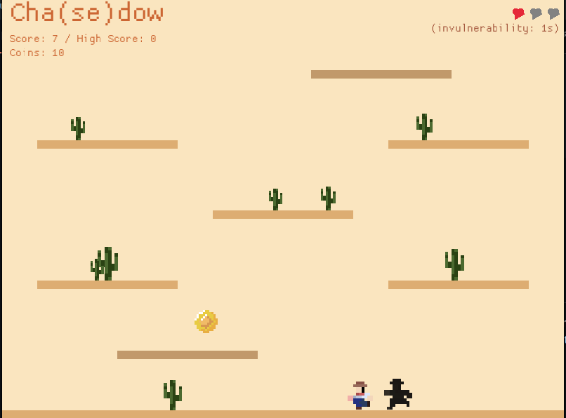

# Chasedow (Shadow Runner)



A fast-paced 2D platformer created for the first annual Quads Jam 2024, themed around "shadow". In this game, you're constantly being chased by your own shadow while navigating through challenging platforming sections. One wrong move, and your shadow catches up to you!

## 🎮 Gameplay

- **Run and Jump**: Navigate through platforms while being pursued
- **Strategic Movement**: Your shadow follows your exact path with a delay
- **Quick Thinking**: Plan your route to keep distance from your shadow
- **Score Challenge**: Survive as long as you can to achieve the highest score

## 🛠️ Technical Details

Built with:
- [Rust](https://www.rust-lang.org/) - Programming language
- [Macroquad](https://github.com/not-fl3/macroquad) - Game framework
- Pure love and learning spirit! 🦀

## 🚀 Getting Started

### Prerequisites
- Rust (latest stable version)
- Cargo (comes with Rust)

### Installation

```bash
# Clone the repository
git clone https://github.com/akartikus/chasedow

# Navigate to the project directory
cd chasedow

# Build and run the game
cargo run --release
```

### Controls
- **Left/Right Arrow Keys**: Move
- **Space**: Jump / Restart when game over
- **Esc**: To pause the game 

## 🎯 Development Journey

This project represents my journey into Rust programming through game development. As my first concrete Rust project, it serves both as a learning exercise and a fun gaming experience. The Quads Jam provided the perfect opportunity to:
- Learn Rust basics
- Understand game development concepts
- Practice with the Macroquad framework
- Create something enjoyable while learning

## 🔄 Future Improvements

- [ ] Add different platform types (moving, disappearing)
- [ ] Implement power-ups
- [ ] Add sound effects and background music
- [ ] Create multiple levels
- [ ] Add visual effects for the shadow
- [ ] Implement a high score system

## 👥 Contributing

While this is primarily a learning project, suggestions and improvements are welcome! Feel free to:
1. Clone the repository
2. Create a feature branch
3. Submit a Pull Request

## 📝 License

This project is licensed under the MIT License - see the [LICENSE](LICENSE) file for details.

---

*Created with 💖 for Quads Jam 2024*
